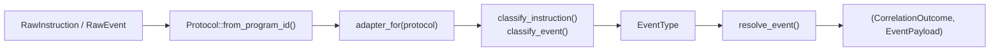
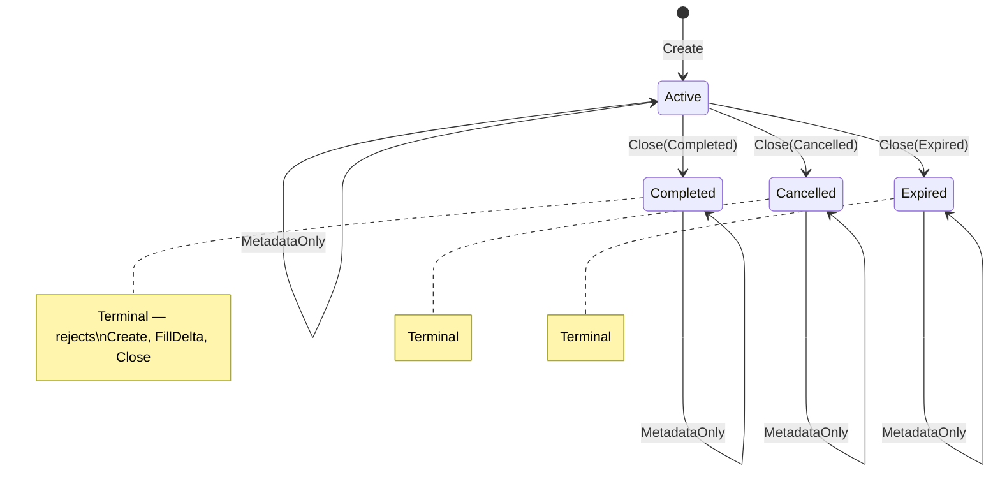
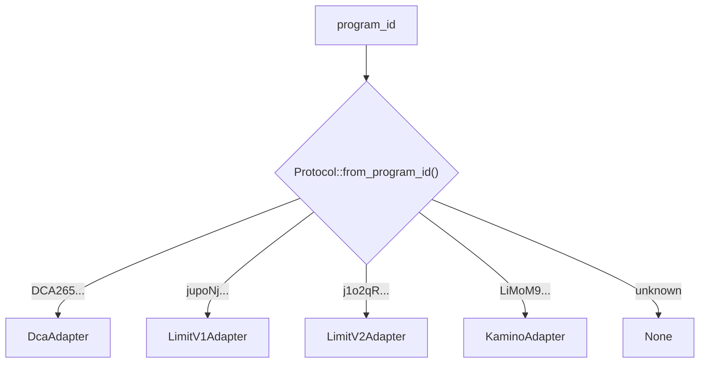

# defi-tracker-lifecycle

Pure-logic crate for DeFi order lifecycle tracking on Solana. No IO, no database — just classification, correlation, and state machine logic.

## Supported Protocols

| Protocol | Program | Description |
|----------|---------|-------------|
| **DCA** | `DCA265Vj8a9CEuX1eb1LWRnDT7uK6q1xMipnNyatn23M` | Jupiter Dollar-Cost Averaging |
| **Limit V1** | `jupoNjAxXgZ4rjzxzPMP4oxduvQsQtZzyknqvzYNrNu` | Jupiter Limit Orders V1 |
| **Limit V2** | `j1o2qRpjcyUwEvwtcfhEQefh773ZgjxcVRry7LDqg5X` | Jupiter Limit Orders V2 |
| **Kamino** | `LiMoM9rMhrdYrfzUCxQppvxCSG1FcrUK9G8uLq4A1GF` | Kamino Limit Orders |

## Architecture

### Event Processing Pipeline



### Order Lifecycle State Machine



### Protocol Adapter Selection



## Core Concepts

**`ProtocolAdapter`** — trait implemented by each protocol. Two phases:
- **Classify**: maps instruction/event names to `EventType` (Created, FillCompleted, Closed, etc.)
- **Resolve**: extracts order PDAs (`CorrelationOutcome`) and structured data (`EventPayload`)

**`LifecycleEngine`** — stateless state machine that enforces transition rules:
- Non-terminal orders accept all transitions
- Terminal orders (Completed/Cancelled/Expired) only accept `MetadataOnly`
- Snapshot deltas are always non-negative; regressions tracked separately

**`ResolveContext`** — carries pre-fetched data needed for correlation (Kamino requires pre-fetched order PDAs since its events don't contain them directly)

## Usage

```rust
use defi_tracker_lifecycle::{
    Protocol, adapter_for, ResolveContext,
    LifecycleEngine, LifecycleTransition,
};

// 1. Identify protocol from program ID
let protocol = Protocol::from_program_id("DCA265Vj8a9CEuX1eb1LWRnDT7uK6q1xMipnNyatn23M");

// 2. Get the adapter
let adapter = adapter_for(protocol.unwrap());

// 3. Classify a raw event
let event_type = adapter.classify_event(&raw_event);

// 4. Resolve into correlation + payload
let ctx = ResolveContext { pre_fetched_order_pdas: None };
let (correlation, payload) = adapter.resolve_event(
    &raw_event, &fields, event_type.unwrap(), &ctx,
)?;

// 5. Check state transition
let decision = LifecycleEngine::decide_transition(
    current_status,
    LifecycleTransition::FillDelta,
);
```

## Testing

```bash
cargo test                  # run all 48 tests
cargo clippy                # lint check
```

### Coverage (requires [cargo-llvm-cov](https://github.com/taiki-e/cargo-llvm-cov))

```bash
cargo llvm-cov                                        # text summary
cargo llvm-cov --html                                 # HTML report → target/llvm-cov/html/
cargo llvm-cov --lcov --output-path lcov.info         # LCOV for CI upload
```

Current coverage: **~66% lines** (48 tests: 34 unit + 14 integration).

| Module | Line Coverage |
|--------|-------------|
| `lifecycle/mod.rs` | 98% |
| `lifecycle/adapters.rs` | 87% |
| `protocols/kamino.rs` | 66% |
| `protocols/limit_v2.rs` | 60% |
| `protocols/limit_v1.rs` | 60% |
| `protocols/dca.rs` | 58% |
| `protocols/mod.rs` | 16% |
